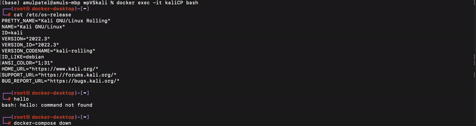

# Project 3 - VirtualBox and Kali

Time spent: **X** hours spent in total

**Homework Instructions**: 

1. Create a GIF recording of you starting your new Kali VM. Show VirtualBox Manger, click Start on your Kali box and end the recording when it reaches the login prompt. If it's larger than 5 MB, try to remove any large swathes of redudant frames. Save it as `vbox_kali.gif`.
2. Create a GIF recording of you running the following command block in your Kali Terminal. Copy it to a text editor first and **replace the first 2 variables, name and univ, with your real name and college name**, then copy/paste the code block into a Terminal. 

```bash
name="Amul Patel"
univ="Temple University"

screenfetch
echo tuo95012@temple.edu
```

Save the file as **screenfetch.gif**.

**Challenges and Problems**: 

### Installing VirtualBox and Kali


 


### Running screenfetch


